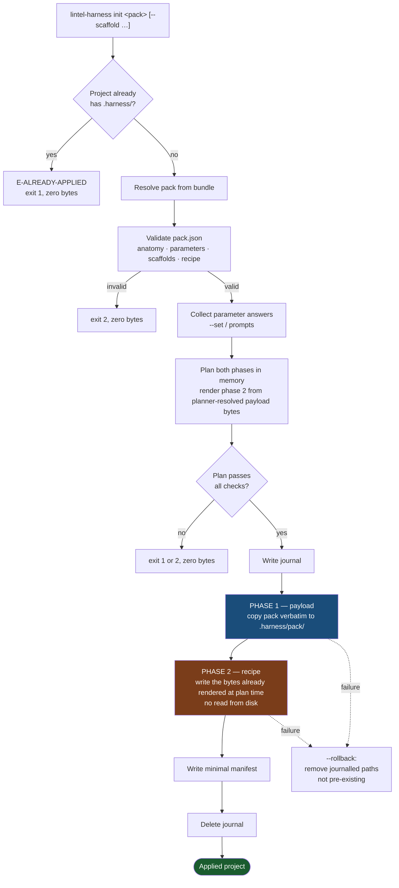

# Pack application — the two-phase model

**Status:** Draft · **Date:** 2026-08-31 · **Applies to:** v1.0
**Decisions:** Q-39 (two phases) · Q-40 (recipe, not script) · Q-41 (the payload is phase 2's source, **rendered at plan time** — see C-23) · Q-42 (v1.0 scope) · Q-43 (minimal manifest) · Q-45 (anchors only) · Q-46 (no bootstrap prose) · Q-54 (six primitives)

**Corrected 2026-08-31 — security conditions C-42 and C-46.** **C-42:**
this document is called *authoritative* by both F1 and the master spec,
and it still described phase 2 as reading `.harness/pack/` **during
execution** — in the *Reads from* cell and in the flowchart's phase-2
node — which is the reading `F1-ADR-001` §3.6 ruled out under **C-23**.
Both now state plan-time rendering and that the executor reads nothing
from disk. The same pass replaced *"needs no validation beyond path
confinement"*, which contradicted F1 US-30, with the bounds phase 1
actually applies. **C-46:** the determinism claim named two inputs where
F1 names **three**; the third, scaffold selection, is corrected here and
in the master spec. Nothing was demoted — the fix is to make this
document true, not to stop calling it authoritative.

Cross-cutting reference. How `lintel-harness init` turns a pack into a
working project. Every pack applies through this model; only phase 2's
recipe differs between packs.

---

## The two phases

| | Phase 1 — payload | Phase 2 — application |
|---|---|---|
| **What** | Verbatim copy of the pack folder | Copies out and wires up the working parts |
| **Destination** | `.harness/pack/` | Project root, `.claude/`, `copy/`, scaffold dirs |
| **Varies by pack?** | **No** — identical mechanism for every pack | **Yes** — each pack ships its own recipe |
| **Transformation** | None. No renames, no substitution, no rewriting | Renames, path rewrites, substitution, generation |
| **Reads from** | The bundled pack in the CLI | **The payload, resolved by the planner at plan time.** `.harness/pack/` is phase 2's *authoritative source* (Q-41) and never the bundle — but the executor **reads nothing from disk**: every byte phase 2 writes was rendered in memory before phase 1 landed a file. `.harness/pack/` is phase 2's **logical** input, and its **literal** input only at `verify` |
| **Run by** | The CLI, automatically | The CLI, automatically — never the user (Q-40) |

**Phase 2 renders entirely at plan time** (C-23, `F1-ADR-001` §3.6, F1
US-30). There is no execute-time read anywhere in an apply: the planner
resolves every step's source out of the payload it is about to write,
renders the result, and `executeApply` only writes. That is what makes
Q-41's recorded consequence — *the user cannot adjust the payload before
phase 2 runs* — literally true, and what keeps Q-40's "no environment
reads" honest, since a filesystem read at step *n* is both an environment
read and an ordering dependence. Read *"phase 2 reads the payload"*
throughout this document as a statement about **provenance**, never about
when a byte leaves the disk.

Phase 1 is a dumb copy on purpose. Because it transforms nothing, it
cannot fail in an interesting way and the result is byte-identical in
content to the pack that shipped. **It is not unvalidated.** Before a
byte lands, the payload is checked for: **symlinks** — any symlink
anywhere in the pack is refused (`E-SYMLINK-IN-PACK`); **path grammar**
— every pack-relative path is `/`-separated, NFC, relative, with no
`..`, no backslash, no drive letter and no segment ending in `.` or
whitespace (`E-PAYLOAD-PATH-INVALID`); **traversal bounds** — the walk
is depth ≤ 32 and ≤ 10 000 entries, `lstat` only, never following a link
(`E-TRAVERSAL-LIMIT`); **size caps** — per file and over the whole
payload (`E-CONTENT-TOO-LARGE`, `E-PAYLOAD-TOO-LARGE`); and
**destination confinement**, including a refusal to traverse or create
through a symlink, junction or other reparse point (`E-DEST-SYMLINK`).
Phase 1 also **preserves no source mode**: every payload file is written
`0644` and every directory `0755` (F1 US-30). F1 owns every code named
here and is the only catalogue. Everything that *varies* is pushed into
phase 2, where it is declared and inspectable.

---

## Flow

**Everything is planned before anything is written.** Validation, both
phases and the manifest are computed in memory; the journal is written;
only then do bytes land. **This is literal, not a figure of speech:**
phase 2's output is fully rendered before phase 1 writes its first file,
so no step's result can depend on what an earlier step left on disk. A
failure in either phase rolls back to the pre-init state, and rollback
never deletes a file that existed before the run.

---

## Phase 2 is a recipe, not a script

A script would make a pack **code that executes on the user's machine**,
which voids the security model — path confinement and the reserved-
destination denylist both depend on the apply plan being inspectable
*before* anything runs.

A recipe is a declared sequence over a fixed set of **six** primitives:

| Primitive | Does | Example from the coding pack |
|---|---|---|
| `copy` | Copy payload path → project path | `agents/*.md` → `.claude/agents/` |
| `rename` | Copy with a new name | `CLAUDE.md.template` → `CLAUDE.md` |
| `strip-suffix` | Drop `.template` from the name | `tone-of-voice.template.md` → `tone-of-voice.md` |
| `rewrite-path` | Replace a literal path string inside content | `template/targets/…` → `.harness/pack/targets/…` |
| `substitute` | Replace `{{harness:param.<id>}}` with an answer | project name into `CLAUDE.md` |
| `generate` | Render a file from payload + answers | `CLAUDE.md` with inert region anchors |

A pack can only do what the primitives allow. A genuinely new step
requires a new primitive in the CLI — deliberately, so the set of things
an apply can do stays enumerable.

### Determinism is a requirement, not a hope

The recipe is a pure function of **(payload, parameter answers, scaffold
selection)** — **three** inputs, and the third is not optional: a
`--scaffold` invocation produces a different tree from a bare one, so a
two-input statement of this claim is false of every scaffolded apply
(F1 §NFR *Determinism* is the authoritative form). No timestamps, no
ordering dependence, no environment or network reads — and, under C-23,
no execute-time filesystem read either. Two applies of the same pack
version with the same answers **and the same scaffold selection** produce
byte-identical trees. This is what makes "applied correctly every time"
testable, and it is why the manifest can stay minimal (Q-43): the
applied state is always recomputable from `.harness/pack/` + the recipe
+ the recorded answers + the recorded scaffolds, so no per-file hash list
and no `.harness/base/` store are needed. `.harness/pack/` is read here,
at `verify` time — which is the **only** place an apply's payload is read
off disk.

**The purity claim holds without exception** (Q-54). `merge-json` was
the only primitive that took a fourth input — the pre-existing content
of its destination — and it is dropped from v1.0, so no primitive reads
anything outside (payload, answers, scaffold selection). `verify`'s
recomputation identity is therefore exact rather than approximate.

---

## What the coding pack's recipe encodes

The nine-step manual-apply log in `CLAUDE.md` §Dogfooding **is** this
recipe. Each hand step becomes a declared primitive:

| Manual step | Primitive |
|---|---|
| `specifications/` kit → `specifications/` | `copy` |
| `agent-teams/` → `AgentTeams/` | `copy` (with rename) |
| `targets/` → `targets/` | `copy` |
| `tone-of-voice.template.md` → `tone-of-voice.md` | `strip-suffix` |
| agents + commands → `.claude/` | `copy` |
| path rewrites in three files | `rewrite-path` |
| rewrote two self-describing READMEs | **none — see below** |
| rewrote the spec README intro | **none — see below** |
| moved the brief into `specifications/` | project content, not an apply step |

The two rewrite steps have **no primitive** because they no longer
happen. Under Q-46 the manual bootstrap prose is deleted from the pack
itself — those sections described a procedure the recipe now performs,
so they are dead content rather than content needing per-project
rewriting. This is also why phase 1 can copy verbatim: there is nothing
left in the payload that is wrong once copied.

---

## What v1.0 does not do

`update`, `status` and `contribute` are deferred to v1.1 (Q-42), and
`--adopt` is dropped (Q-44). v1.0 applies a pack; it does not maintain
one.

Two pieces of forward investment keep v1.1 an addition rather than a
retrofit:

- **The minimal manifest** records pack name, version, CLI version,
  parameter answers and chosen scaffolds — enough for a later `update`
  to know what was applied and recompute the expected tree.
- **Inert region anchors** are emitted into the generated `CLAUDE.md`
  (Q-45) so a later `update` can find pack-owned regions. No parser,
  no region hashes and no tamper detection ship at v1.0.
