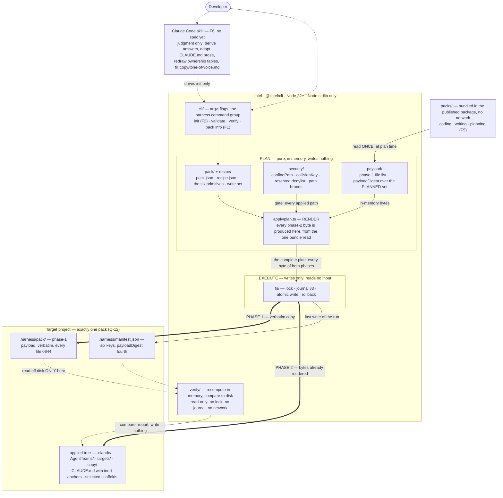

# System Architecture — Lintel Harness

**Status:** Draft
**Applies to version:** v1.0 — five-feature baseline: F1, F2, F3, F5, F6 (**F3 returned to v1.0 with Q-62**; F4 alone is reserved for v1.1)
**Date:** 2026-09-01
**Sources:** `v1.0/LintelHarnessSpecification-1.0.md` · `v1.0/F1-spec-pack-format-and-manifest.md` v2.8 · `v1.0/F1-ADR-001-pack-format-and-manifest.md` (file-level plan, public interface contract, §7 security architecture, §10 FINAL verdict) · `v1.0/F5-spec-template-packs.md` v2.7 · `general/pack-application.md` · `general/pack-inventory.md` · `general/interaction-model.md` · `general/technology-choices.md` · `project-brief.md` §12 (Q-1…Q-62)

> The "shape of the whole system in one place" companion to `technology-choices.md`
> (**written**, and the owner of the per-area technology reasoning this document only
> summarises in §5) and to `general/interaction-model.md` (**written**, and the owner of
> what using the system is *like* — the two entry points, the CLI/skill seam and the
> reconciliation §4 below assigns to F6). Where the per-feature specs answer *"what does this
> feature do?"*, this answers *"how does the whole system fit together?"*. Greenfield
> Node/TypeScript, no runtime dependency outside the Node standard library; nothing
> here is reused from an existing platform.
>
> **Version-spanning and version-true.** It describes v1.0 as specified, not v1.0 as
> hoped for. Where v1.0 does not have something, this document says so.
>
> **Living document.** Review on every version bump; keep the `## Change history` current.

---

## 1. Architectural principles (the shape in one breath)

Nine invariants. Each is load-bearing: remove it and something else in the system
stops being true.

- **Plan everything, then write.** Validation, both phases and the manifest are
  computed **in memory**; a journal is written; only then do bytes land
  (`pack-application.md`, F1 US-13, §F1.6). *Consequence:* "zero bytes written unless
  every check passed" is literal rather than aspirational, and it is the property §3
  is built on — including for the manifest, whose `payloadDigest` is computed over the
  **planned** payload set, not over what is on disk afterwards (F1 US-30).

- **Phase 2 renders at plan time; the executor reads nothing from disk.** Every byte
  phase 2 emits is produced before phase 1 writes its first file (C-23, `F1-ADR-001`
  §3.6, F1 US-30). *Consequence:* `.harness/pack/` is phase 2's **logical** input and
  its **literal** input only at `verify`. There is no window in which content could
  change after `payloadDigest` was computed, and no step's output can depend on what
  an earlier step left on disk.

- **The recipe is a pure function of (payload, parameter answers, scaffold
  selection).** Three inputs, and the third is not optional — a `--scaffold` apply
  produces a different tree (F1 §NFR *Determinism*; the two-input form was corrected
  under C-46). *Consequence:* the manifest can stay at six keys with no per-file hash
  list and no `.harness/base/` store (Q-43), and `verify` can **recompute** the
  expected tree instead of remembering it (F1 §F1.8). After Q-54 the claim holds at
  every applied path with **no exception**, because `merge-json` — the only primitive
  that read its destination's prior content — does not ship.

- **The primitive set is closed at six.** `copy`, `rename`, `strip-suffix`,
  `rewrite-path`, `substitute`, `generate`, matched **literally** — `"copy "` with a
  trailing space is `E-RECIPE-PRIMITIVE-UNKNOWN` (F1 US-31). *Consequence:* what an
  apply can do stays enumerable, so `pack info` can render the complete list of what
  an apply will do before it does it. **A new kind of step is a CLI change, not a pack
  change**, deliberately. The step count is bounded at 256 for the same reason: an
  unbounded list degrades that control continuously while naming no point at which a
  reviewer should stop trusting it (C-30).

- **Packs are data, not code.** This is why phase 2 is a recipe rather than a script.
  A script would make a pack *code that executes on the user's machine*, which voids
  the security model outright, because path confinement and the reserved-destination
  denylist both depend on the plan being **inspectable before anything runs**
  (Q-40). *Consequence:* there is no `exec`, `script` or `shell` op and no escape
  hatch of any kind — and, per the ADR's file plan, no `src/recipe/ops/exec.ts` to add
  one to.

- **A reserved *name* is reserved at every segment; `.harness/` is the only *location*
  entry in the whole design.** `.git`, `.hg`, `.svn`, `.github`, `.vscode`, `.idea`,
  `node_modules`, `.circleci`, `.devcontainer` are reserved wherever they appear;
  `settings.json` and `settings.local.json` under **any** `.claude` segment (F1 US-3
  stage 2, C-33/C-39). *Consequence:* a nested `docs/.claude/settings.json` or
  `pkg/node_modules/.bin/foo` is refused by the same rule as the root-level one, and
  the quantifier is stated next to the property rather than re-derived per rule. This
  is the lesson of the final security round: *every HIGH was a repair that stopped one
  step short of the principle it established.*

- **Two brands, and no writer takes a bare string.** `AppliedPath` (the sole output of
  the confinement gate) and `HarnessPath` (the CLI's own five writes under
  `.harness/`), with `WritablePath = AppliedPath | HarnessPath` on the journal, the
  atomic writer and rollback (C-14, `F1-ADR-001` interface contract). *Consequence:* a
  path that skipped the gate cannot reach a writer without a compile error, the
  denylist can forbid `.harness/` **absolutely** without deadlocking against the
  payload copier, and phase 1 is journalled and rolled back exactly like phase 2
  without being privileged.

- **Deterministic mechanics in the CLI, judgment in a thin skill.** The seam is a
  decision, not an accident (Q-1): a mechanism that varies run to run is not a
  mechanism, and a CLI can only stub out the parts that are genuine judgment.
  *Consequence:* build order is CLI first, skill last, and the skill wraps the **two
  writing commands, `init` and `update`** — the two with judgment work on the far side
  of them (Q-62). `validate`, `verify` and `pack info` are read-only diagnostics a
  person or CI runs directly, as is `update`'s read-only mode. The seam is sharpest at
  `update`: the CLI replaces what it can compute an answer for and **deliberately stops**
  at an edited path, which is the one place it hands work over rather than finishing or
  failing. `general/interaction-model.md` owns that handover as a requirement.

- **Say what is not enforced.** Severity is a property of the **code**, never of the
  occasion; the `E-`/`W-` codes plus exit classes `0/1/2/3` are the **only** CLI error
  model, and F1 §Error States is the only catalogue (**87** codes at F1 v3.0). *Consequence:* F6 and
  CI branch on codes and never on prose — and, symmetrically, where a control is
  incomplete the design states it: reserved-destination class 2 is a **denylist and
  therefore incomplete by construction**, and an agent file's `tools:` list is
  **disclosed rather than gated** because gating it would delete the feature.

---

## 2. Container diagram (system context + containers)



**How to read it.** Solid arrows are the primary runtime flow; dotted arrows are
control, human-in-the-loop, or read-only. The single most important path is
`bundle → payload/ → render → fs/ → project`, and the thing to notice is what is
**missing**: there is no arrow from `.harness/pack/` back into `apply/plan.ts`. The
executor consumes the plan and writes; it never reads an input. The only arrow out of
`.harness/pack/` is the dotted one into `verify/`, which is the one place an apply's
payload is read off disk (C-23). The two thick arrows are the phase boundary — phase 1
lands the payload verbatim, phase 2 lands bytes that already existed in memory before
phase 1 started writing.

Group names are the ADR's file-level plan. `pack/`, `recipe/`, `payload/`, `security/`
and `apply/plan.ts` are all **pure** — no filesystem handle reaches them except the one
bundle read — which is what lets `validate` run in CI against a pack with no target
project at all.

---

## 3. The trust-critical path — validate → plan → journal → write

The load-bearing flow is `init`, and its guarantee is one sentence:

> **Zero bytes are written unless every check passed — not even `.harness/`.**

Everything else in this section exists to make that sentence true rather than
asserted.

```
lintel harness init <pack> [--scaffold …] [--set k=v] [--force]

  1  .harness/ already present?    → E-JOURNAL-PRESENT (2) / E-ALREADY-APPLIED (1)   0 bytes
  2  resolve pack from the bundle; minCliVersion, formatVersion                      0 bytes
  3  validate — US-16 checks 1–10: pack.json schema + strict JSON parse, anatomy,
        PAYLOAD INTEGRITY (symlinks, path grammar, traversal + size bounds, and
        permission-bearing .claude/ frontmatter over the PHASE-1 PAYLOAD SET),
        recipe schema, step sources, → WRITE SET computed once ← destination
        safety, executable declarations, hook-script disclosure, parameters,
        scaffolds                                                                    0 bytes
  4  collect answers (prompt or --set); typed, maxLength first, then pattern         0 bytes
  5  realpath(project root) — resolved ONCE for the whole run                        0 bytes
  6  PLAN BOTH PHASES IN MEMORY   ← the ONLY read of the bundled pack
        phase 1: payload file list  →  payloadDigest over the PLANNED set
        phase 2: EVERY step rendered here, from those same in-memory bytes
        every applied path in every write set through the four-stage gate
        US-16 checks 11–14 over the one combination the answers select
        the manifest and the security disclosure are built here                      0 bytes
        └─ any failure → exit 1 or 2, ZERO bytes
  ────────────────────────────── the gate closes here ──────────────────────────────
  7  take .harness/lock                        (E-LOCK-HELD / W-LOCK-STALE-BROKEN)
  8  write .harness/journal.json  (v3)         ← the first byte of the run
  9  PHASE 1 — write the payload verbatim to .harness/pack/, files 0644, dirs 0755
 10  PHASE 2 — write the bytes rendered at step 6; NO read of disk
        per write: re-confine (stage 3) → exclusive create → link/rename
        └─ target moved in the window → E-TARGET-RACE (2), journal intact
 11  write .harness/manifest.json                ← the last write of an apply
 12  delete journal + journal.d/, release the lock   ← apply complete

  FAIL at 9, 10 or 11  →  journal survives; `init --rollback` reverses it.
```

### The four confinement stages

Confinement is **by resolution, not by string** — inspecting a declared string says
nothing about the filesystem that string will meet (F1 US-3, `F1-ADR-001` §7.1).

| Stage | When | What |
|---|---|---|
| **1 — anchored `to` grammar** | declaration time; runs at `validate`, which has no project | One rule, one code (`E-MAP-PATH-GRAMMAR`): the segment grammar, no leading separator, no `\`, no `C:\x` **or** drive-relative `C:x`, no `//`/`\\` prefix, no `.`/`..`/empty segment, no segment ending in `.` or whitespace, no reserved Windows basename, NFC mandatory. Payload paths get the same grammar as `E-PAYLOAD-PATH-INVALID` |
| **2 — reserved-destination denylist** | declaration time, on the resolved path | Two **declared, closed** classes matched by `collisionKey` (NFC + case-fold, on every platform, unconditionally): tool/VCS-owned trees, and destinations a common toolchain executes. `E-MAP-RESERVED-DEST`, exit 2 |
| **3 — resolution confinement** | plan time and write time only; **skipped at `validate`** | Root resolved once with `realpath`; every ancestor `lstat`ed top-down (`E-DEST-SYMLINK` on a symlink, junction or reparse point); directories created one level at a time, each checked before the next; the final destination must be a **strict descendant** of the resolved root (`E-MAP-ESCAPES-ROOT`) |
| **4 — the write itself** | write time | Stage 3 re-run immediately before each write, because the plan's `lstat` is stale by then; exclusive temp create (`open(tmp,'wx')`); `link(tmp,dest)` then `unlink` for a path expected to be new; re-hash for a `--force` byte-identical path. Any confirmation failing is `E-TARGET-RACE` |

Stage 3 is deliberately absent from `validate`: a pack must be checkable in CI with no
target project, which is what makes the authoring-time checks the high-value half of
the security model (`F1-ADR-001` §7.0).

### The two quantifiers

A rule quantified over the wrong set is the defect this design has hit three times, so
the sets are named:

- **The write set** — every applied path a step's bytes create or change, per
  primitive (F1 §F1.2). It is the quantifier for the grammar, the denylist, the
  collision rules and the executable rules. It is **not** `to`: `rewrite-path` and
  `substitute` have no `to`, so a rule over `to` has two silent exemptions, which is
  exactly how the denylist lapsed (C-19). The write set is a **pure function of the
  pack** and is computed **once**, after `validate` step 5.
- **The phase-1 payload set** — every path phase 1 copies. It is disjoint from the
  write set (a `HarnessPath`, not an `AppliedPath`), and it is the **second**
  quantifier for `E-CLAUDE-TOOL-GRANT` / `E-CLAUDE-PERMISSION-MODE` (C-39c). A pack
  that merely *ships* `.claude/commands/x.md` with `allowed-tools` and names it in no
  recipe step still lands it at `.harness/pack/.claude/commands/x.md`, **inside the
  committed project**. Widening the write set to cover it was rejected: that would
  break the brand separation and deadlock the denylist against the payload copier.

### The journal, and the rollback invariant

Before any write, a **version-3 journal** records the command that wrote it and, per intended path: an **`intent`** of `write` or `delete`, the hash this
apply intends to write, **`preExisting`**, the pre-apply hash and mode (both `null`
when the path did not exist), and a backup under `.harness/journal.d/` taken *before*
any overwrite. It covers **both phases** and the directories created, in creation
order (F1 US-13).

The invariant: **rollback deletes only paths this apply created, restores only paths
this apply overwrote, and acts on neither unless the on-disk bytes are still exactly
what this apply wrote.** Five exhaustive cases; a user who edited a file after the
crash keeps their edit and is told (`W-ROLLBACK-KEPT`).

`preExisting` is determined by `collisionKey`, not by exact string, and that is a
rollback-safety requirement rather than tidiness (N-5): on macOS and Windows a project
holding `.claude/Settings.json` and a step writing `.claude/settings.json` are the
**same file**, and under exact-string comparison the journal would record
`preExisting: false` and `--rollback` would then **delete a user file it did not
create**.

### `payloadDigest` — checked first, fail-closed

`verify` recomputes the tree digest over `.harness/pack/` and compares it to the
manifest **before it renders anything**. A mismatch is `E-PAYLOAD-DIGEST-MISMATCH`,
exit 2, and **the tree comparison is suppressed entirely** — no path recomputed, empty
per-path report. The reason is not convenience: the expectation is computed *from* the
payload, so once the payload is untrusted the recomputation is meaningless and
reporting it would dress an untrustworthy answer as a result (F1 US-33, §F1.8). There
is no "digest absent, so skip the check" branch — that branch is the one anybody
defeating the check would take.

Two drifts, two codes, two exit classes: the payload moved (`E-PAYLOAD-DIGEST-MISMATCH`,
exit 2) or the applied tree moved (`E-VERIFY-MISMATCH`, exit 1). That is what Q-52
buys — `verify` can say **which side moved**.

### Three kinds of expected movement, and only one kind of drift

The applied tree moving is not always drift. `verify` reports **six**
states per path — `match`, `adapted`, `filled`, `unfilled`, `differs`,
`missing` (Q-56, Q-79) — because `differs` was doing two jobs: *someone
changed this*, and *this was supposed to change*. **Q-79 split the
second job again**: a file the skill is meant to adapt and a file the
*user* is meant to fill in are both expected to move, and only one of
them is anybody's job to check. `filled` and `unfilled` name a
fill-expected path that has and has not been completed; **`unfilled` is
a `notice`** and is the one state that reports work still owed by the
person who applied the pack. Neither affects the exit code. A recipe step declares its output
**adapt-expected**; the generated `CLAUDE.md` is, in all three packs,
because it carries project-owned prose F6 exists to adapt. Such a path
reports `adapted`, which is **not** a failure and does not affect the
exit code. A path not so declared still reports `differs` and still
fails — this is a per-path declaration, never a blanket suppression.

Without it, S7's release gate and F6's stated job contradicted each
other: the gate requires a green `verify`, F6 adapts `CLAUDE.md`, and
Q-57 made the skill the normal path rather than an edge case. **The
manifest gains nothing for it** — the adapt-expected set is recomputable
from the payload and the recipe, which the recomputation already reads,
so the six keys stand.

### Diagnostics carry a class

Every code is classified once, in F1's catalogue. A **defect** is
author-fixable — a missing folder README, a dangling link. A **notice**
reports a declared state the pack intends — a `provisional` anatomy
part, an inert hook script. **`--strict` promotes defects only**, and a
notice is never fatal under any flag; an unclassified code defaults to
`defect`, so a forgotten classification makes CI louder rather than
quieter (Q-60).

This is the same repair as `adapted`, one layer down: a single severity
was reporting both *this is wrong* and *this is deliberate*, which left
`validate --all --strict` unable to pass for two of three bundled packs
— for reasons that were design decisions, not defects.

### What this path does not guarantee — stated, not implied

1. **Reserved-destination class 2 is a denylist, and a denylist is incomplete by
   construction.** It closes the routes this design has identified, each with a named
   rule and an adversarial fixture in CI. It is **not** a proof that no other
   destination on a user's machine is executed by some toolchain. The evidence that
   the gap is real rather than theoretical: `.mcp.json` — which declares MCP servers
   as command lines the runtime launches, and is the sibling of
   `.claude/settings.json` — was absent from the entire spec set until the fourth
   security round, one `copy` away (C-41).
2. **The digest does not bind the manifest to itself.** `payloadDigest` binds the
   payload to the manifest; nothing binds the manifest to itself, so someone who edits
   the payload *and* recomputes the digest defeats the check. That is deliberate work
   rather than an accident, and it is acceptable only because v1.0 never merges
   against the manifest. Separately, the digest is over **normalized** content, so a
   **pure line-ending edit of the payload is undetectable** — the price of not making
   every Windows clone with `core.autocrlf` report a tampered payload on its first
   `verify` (Q-26, Q-52).
3. **The `.claude/` frontmatter rule is pinned against a contract this design does not
   own.** The permission-bearing key names and the non-widening `permissionMode` value
   set belong to the Claude Code runtime and move independently. The two halves fail
   in **opposite directions**: a key the runtime adds after the pin is taken is **not
   caught** and fails silently; an unrecognised *value* is refused loudly. Keeping the
   pin current is a standing maintenance obligation (F1 §F1.9 limit 12, obligation 13),
   not a property of the format.
4. **A pack does place content an agent runtime reads and acts on.** Two of `coding`'s
   ten agents declare `Bash`; `researcher` declares `WebSearch, WebFetch`, the only
   network capability any v1.0 pack ships. None of it is a *grant* — the permission
   engine lives in `.claude/settings.json`, which no pack can write at any `.claude`
   segment — but it is not nothing, and it is **disclosed verbatim** rather than
   claimed away. Note the distinction: §NFR *No network* is a claim about the **CLI**,
   and says nothing about what the runtime does with content the pack placed.

---

## 4. Feature → component map

| Layer | Features | Responsibility |
|---|---|---|
| **Format & contracts** | **F1** (spec v3.0 + ADR-001) | `pack.json`, `recipe.json`, the six primitives, the six-key manifest, the four-stage confinement gate, the journal/rollback contract, the diagnostic taxonomy — and the three read-only commands `validate`, `verify`, `pack info` (Q-53). Modules: `pack/`, `recipe/`, `json/`, `manifest/`, `hash/`, `payload/`, `security/`, `verify/`, `validate/`, `diag/`, `fs/`, plus `apply/plan.ts` |
| **Apply engine** | **F2** — **no feature spec** | `lintel harness init`: the CLI surface, interactive prompting, and driving `apply/plan.ts` → `apply/execute.ts` → `apply/rollback.ts`. F1 pins the phases, primitive semantics, ordering and atomicity; F2 implements them and may not reinterpret them. There is deliberately **no `src/cli/commands/init.ts` in F1's plan** |
| **Update engine** | **F3** — **no feature spec** | `lintel harness update`, returned to v1.0 by **Q-62**. It recomputes `expected_old` (local `.harness/pack/` + its recipe + the recorded answers — the identity `verify` already uses) and `expected_new` (the newer bundled payload), classifies each path, **replaces the unedited outright**, and **leaves the edited untouched and reports them**. `adapted` paths are never blindly replaced, being edited on purpose (Q-56). `status` is this command's **read-only mode**, not a fourth command. **No merge engine, no conflict markers, no three-way merge** — the judgment is F6's, not the CLI's |
| **Pack content** | **F5** (spec v2.7) | The three packs and their recipes: `coding` (migrating), `writing` (to extract), `planning` (to author); the nine-part anatomy declarations, the three scaffolds, the Q-46 prose stripping, the two pack-local copies of the targets contract (Q-49). F1 ships no pack; `validate --all --strict` is what binds them |
| **Judgment layer** | **F6** — **no feature spec** | The thin Claude Code skill. After `init`: derive parameter answers from what the repo actually is, adapt the generated `CLAUDE.md`'s project-owned prose around the inert anchors, redraw file-ownership tables, fill `copy/tone-of-voice.md`. After `update`: **reconcile the edited paths conversationally** — the case F3 deliberately stops at. It wraps the two writing commands, `init` and `update`. Cutting it no longer leaves the release gate intact in the way it once did: S7 now requires the repo to be *maintained by* `update` (Q-62), and `update` without F6 leaves every edited path unreconciled |
| **Deferred** | **F4** — v1.1 | `contribute` alone. The number is **reserved and will not be reused**. **F3 is no longer here** — Q-62 returned it to v1.0, and with it G3, S3 and R4 |

**The three forward investments are no longer forward investments.** Inert region
anchors (Q-45), the minimal manifest (Q-43) and `payloadDigest` (Q-52) were each
justified as cheap-now, expensive-to-retrofit groundwork **for `update`**. Q-62 brings
`update` into v1.0, so all three are simply **used**, and by a shipping feature:

| | What it now does | Where |
|---|---|---|
| The minimal manifest | Supplies the recorded answers and the pack version `update` recomputes `expected_old` from, and names the pack version to compare against | Q-43, F3 |
| `payloadDigest` | Gates the recomputation fail-closed — the same first-and-fail-closed check `verify` makes, for the same reason: once the payload is untrusted, `expected_old` is meaningless | Q-52, F3 |
| Inert region anchors | Mark the project-owned prose in the generated `CLAUDE.md`, which is the `adapted` path `update` must never blindly replace | Q-45, Q-56 |

The anchors keep the "inert" part of their name: **nothing parses them at v1.0**, and
`update` does not need them to, because it classifies by recomputation rather than by
region. They are the affordance that makes a *later* region-aware merge possible without
a format change, and that is now the only forward-looking claim any of the three carries.

**What remains forward investment, and it is for `contribute` alone (F4):** the same
recomputation identity, pointed the other way. `verify` and `update`'s read-only mode
already report which applied paths differ from what the pack would produce — which is
exactly the set `contribute` would propose promoting back into the pack. Nothing else in
v1.0 is built for F4, and no v1.0 component may be shaped around it.

**What is unwritten, named so the absence is not read as an oversight:** F2, **F3** and
F6 have **no feature spec, no ADR and no epics-and-tasks** — F3 least of all, having
been in v1.0 for a matter of hours; F5 has a spec but **no ADR**; and no feature has an
epics-and-tasks document. Both of this document's stated companions are now **written**:
`general/technology-choices.md` and `general/interaction-model.md`. The master spec
records the rest under *Spec-set readiness*, which states plainly that **this set is not
implementation-ready** — and Q-62 has just added a feature to it.

---

## 5. Key technology decisions (as of v1.0)

Each row cites the question that settled it. Full rationale lives in
`project-brief.md` §12; the *reason* column is the short form of why, not a restatement
of the decision.

| Concern | Choice | Why | Source |
|---|---|---|---|
| Execution split | Node/TypeScript CLI for the deterministic mechanics + a **thin** Claude Code skill for judgment; CLI built first | Determinism cannot be delegated to an agent — hashing, planning and comparison must be computed facts or "applied correctly every time" varies run to run. But applying a pack is not purely mechanical, and a CLI could only stub the judgment out. Split on that seam, and build the wrapper last so it is written once | **Q-1** |
| Pack distribution | `packs/` in this repo, bundled into the published package. No registry, no fetch | One maintainer, three packs: a monorepo makes a CLI feature and the pack change that needs it one atomic commit and one release, and removes the CLI↔pack compatibility problem entirely. `npx` then needs no network | **Q-2** |
| Versioning | Per-pack semver + `minCliVersion`, plus a separate CLI semver; the manifest records both | Lets `update` be precise later ("you applied `coding@1.0.0`, latest is `1.4.0`") and keeps a writing-only project from being told it is stale because the coding pack moved. A rolling unversioned CLI was rejected: a behaviour change could silently reinterpret an old manifest with no version to pin it against | **Q-3** |
| Apply model | **Two phases** — verbatim payload copy to `.harness/pack/`, then a pack-specific application | It matches what the manual apply actually was: a dumb copy, then a tie-up. The single-phase model treated the second half as awkward exceptions to the first. Splitting makes the generic half generic and the varying half explicitly per-pack | **Q-39** |
| Phase 2 form | A **declarative recipe** over six primitives, run by the CLI, never by the user | A script makes a pack code that executes on the user's machine, which voids confinement and the denylist — both depend on the plan being inspectable *before* anything runs. A recipe keeps per-pack variation while staying validatable | **Q-40**, narrowed by **Q-54** |
| Phase 2's input | `.harness/pack/` is authoritative (never the bundle) — but rendered **entirely at plan time**; the executor reads nothing from disk | Q-41 fixes *which tree is authoritative*, not *the moment of the read*. An execute-time read would be an environment read (Q-40 forbids), would open a window in which the payload could change after `payloadDigest` was computed, and would falsify Q-41's own recorded consequence that the user cannot adjust the payload between phases | **Q-41** as clarified by C-23 / `F1-ADR-001` §3.6 |
| Manifest | **Six keys**: `manifestVersion`, `cli`, `pack`, `payloadDigest`, `parameters`, `scaffolds`. No file list, no `.harness/base/`, no timestamp, no self-hash | With the payload local and the render deterministic, the applied state is **recomputable**, so a hash list and a cached base are both redundant. Omitting a timestamp is what makes "byte-identical trees" true of the whole project rather than of everything except one file — version control already records when | **Q-43** (supersedes Q-18, Q-19) |
| Payload integrity | One SHA-256 **tree digest** over `.harness/pack/`, top-level between `pack` and `parameters`, over **normalized** content | Recomputation otherwise silently *trusts* the payload: edit `.harness/pack/`, and `verify` reports the project clean because the recipe faithfully reproduces the edited input. One hash over one tree is the smallest closure of that gap, and it is what lets `verify` say which side moved. Top-level because `pack` records what the pack *declared* and the digest records what this apply *observed* | **Q-52** (amends Q-43) |
| Marked regions | **None.** The generated `CLAUDE.md` carries **inert** anchors; nothing parses them | Regions had two justifications and both were removed: `update` was their consumer, and the source-only/applied-only problem dissolved once phase 1 copies verbatim. Anchors are near-free now and expensive to retrofit, so they ship as forward investment and nothing more | **Q-45** (amends Q-7, Q-10) |
| Pack cardinality | **Exactly one pack per project.** The manifest has one `pack` object, not a list | Removes the file-collision and ownership-arbitration class of problems rather than solving it. Two ways of working means two projects side by side. This is the single assumption most likely to be "helpfully" relaxed later, and relaxing it reopens everything Q-12 closed | **Q-12** |
| Settings & permissions | `merge-json` **dropped**; nothing writes `.claude/settings.json`, and that is a *checked* rule rather than a fact about three packs | Once F5's three settings steps were established as invalid recipes, the primitive had **no v1.0 consumer** while carrying the format's largest attack surface — it was the target of both CRITICALs of the second security round. Deleting the surface is a stronger fix than repairing it. Bonus: it was the only primitive taking a fourth input, so determinism and the recomputation identity become true *without exception*. **R5's "sensible default permissions" waits for v1.1** | **Q-54** (supersedes Q-23) |
| Keeping a project current | **`update` ships at v1.0 and builds no merge engine.** Recompute `expected_old` and `expected_new`, classify per path, replace the unedited, leave and report the edited, never blindly replace an `adapted` path. `status` folds into its read-only mode; `contribute` stays deferred | The blocker Q-42 deferred it for no longer exists: a merge needs a base, the answer then was `.harness/base/`, and Q-39/Q-43 deleted that store because the two-phase model made it unnecessary. The payload is **local** and the recipe **deterministic**, so `expected_old` is recomputable exactly — **`verify` is most of `update`** already. The shape follows the evidence: the dogfooding pass found 12 of 16 applied files byte-identical, so a merge engine would be built for the minority case while the majority needs only a replace. The remainder is judgment, which is what the skill is for (Q-1) on the path Q-57 made primary | **Q-62** (reverses **Q-42** for F3) |
| Empty directories | **Every folder an apply creates carries a README** (`README.md`; `index.md` for `writing`), `.claude/` and `.harness/` excluded as tool-owned | It dissolves the empty-directory problem instead of solving it: git cannot commit an empty directory, so any answer needed placeholder files — Q-50 makes those files *say something*. Consequence for the format: no `mkdir` primitive, no eighth primitive, no `skeleton/` tree, no `.gitkeep` | **Q-50** |

> **Pending sign-off:** none of the rows above. What is outstanding is *work*, not
> decisions. `general/technology-choices.md` **now exists** and holds the per-component
> reasoning these rows only summarise — including the **⚠️ register** of capabilities the
> specs require but for which no library has been chosen, which is where the genuinely
> open technology questions live. What is still missing is the **F2, F3 and F6 specs**
> that would consume several of these rows. See §6 and the master spec's *Spec-set
> readiness*.

---

## 6. The state of the design — read this before treating the set as cleared

Three facts a reader needs before the feature specs, none of them flattering.

**1. The security gate is closed by decision, not by a verdict.** **No
`SECURITY-PROCEED` exists against any revision of F1, F5 or ADR-001, and none is
claimed.** ADR-001 §10's `PROCEED` is an *architectural* verdict and explicitly says it
must not be read as a security clearance. Four Mode A rounds ran:

| Round | Against | Result |
|---|---|---|
| 1 | F1 v1.0 | `REVISE-SPEC` — 2 CRITICAL, 4 HIGH · C-1…C-18 |
| 2 | F1 v2.2 | `REVISE-SPEC` — 2 CRITICAL, 3 HIGH · **six conditions found lapsed** · C-19…C-30 |
| 3 | F1 v2.3 | `REVISE-SPEC` — **0 CRITICAL**, 2 HIGH · 24/31 holding · C-31…C-38 |
| 4 | F1 v2.4 | `REVISE-SPEC` — **0 CRITICAL**, 3 HIGH · **36/38 holding** · C-39…C-48 |

The standing verdict of record is `REVISE-SPEC`. What the decision rests on is the
**trajectory** and the honest observation that every round-3 and round-4 finding
concerned the membership or the quantifier of a **denylist** — so there is no round at
which a reviewer runs out of destinations to name. The two structural defects round 4
found (a rule that did not reach phase 1; a pin narrower than the property it
implemented) are closed; what remains is enumeration. Two process controls now stand
behind that judgement, and both were added because a green disposition table twice
failed to detect a lapse: a `SATISFIED` disposition must cite **the mechanism and its
quantifier**, never a section number; and every closed attack gets an **adversarial
fixture pack** in CI, asserted on the exact code and exit class.

**2. `§F1.9`'s known limits and v1.1 obligations are part of the contract, not
commentary.** Fifteen known limits and sixteen v1.1 obligations are written out there,
and **C-47 plus the remaining LOW residue are *accepted* for v1.0** — accepted with
their requirements and tests recorded, which is a commitment to build them, not a
decision to forget them. The sharpest limits to know before reading anything else: an
answer cannot be changed after apply (Q-21), a pack cannot contribute project settings
or ask for a permission by any of four doors, content cannot vary *within* a file by
answer, and a pack cannot edit a JSON file the project already has.

**3. The packs are authored; the dogfooding is not done.** This section previously
reported the packs as largely unauthored. **That is no longer true and the entry is
rewritten against the repo rather than against another document** — which is how the
old entry went stale. Verified on disk:

| | Position on disk |
|---|---|
| `pack.json` | **Present in all three packs** — `coding`, `writing`, `planning` |
| `recipe.json` | **Present in all three packs.** Step counts: **coding 21**, **writing 12**, **planning 23** — where coding and writing count their base steps plus every declared scaffold branch (coding 15 base + 3 `backend-azure` + 3 `backend-aws`; writing 7 base + 5 `writing-workstream`), of which only the selected branch runs in any one apply. Planning declares no scaffolds, so its 23 all run |
| `packs/coding/commands/target.md` | **Present.** `planning` ships four commands of its own; `writing` ships none |
| The scaffold rename | **Done.** `infrastructure/backend-deploy/` is now **`scaffolds/backend-azure/`**, and **`scaffolds/backend-aws/` is authored** alongside it |
| **Five** applied paths carrying a `{{harness:` token (F1's C-43 positive assertion) | **Met, at exactly five**: `CLAUDE.md.template`, `agent-teams/Specify.md`, `agent-teams/Implement.md`, `specifications/README.template.md`, `specifications/project-brief.template.md` |
| `.harness/pack/` and `.harness/manifest.json` in this repo | **Absent** |

`applied-readmes/` exists with exactly its five files, and the ten agents carry the
`permissionMode: readonly` frontmatter F1's positive assertion requires.

**What is still outstanding is the last row, and it is the whole of it. `S7 is unmet`:
this repo is not yet produced by the tool it specifies.** Nothing here has been applied
by `lintel` — the current tree is still the hand-made apply the dogfooding log
records. The gap is no longer authoring; it is that **there is no CLI to run**, so the
remaining step is the release gate itself rather than a step before it. Q-62 also
raises the bar the gate must clear: S7 now reads *produced by `lintel harness init
coding` **and maintained by `lintel harness update`***, so demonstrating it takes an
apply **and** an update, not an apply alone.

> Read this row as the standing check on the rest of the section. It is the one claim
> here that a `find` can settle in a second, and the reason the table above now cites
> what was observed rather than what a spec asserts.

---

## Change history

| Version | Date | Author | Change |
|---|---|---|---|
| v1.0 | 2026-08-31 | architect | Initial version. First document to describe the whole system after Q-39's two-phase rewrite; records the principles, the container shape, the `validate → plan → journal → write` trust path with its stated limits, the feature→component map including what is unwritten, and the twelve load-bearing technology decisions with their originating question ids. |
| v1.1 | 2026-09-01 | architect | **Q-62 fold, plus a reconciliation against the repo.** F3 returns to v1.0 and gets its own §4 row (`update`, replace-or-hand-over, no merge engine); F4/`contribute` alone remains deferred. The §1 seam principle and the F6 row are corrected — the skill wraps **`init` and `update`**, not `init` alone, and F6 is no longer cleanly cuttable now that S7 requires the repo to be *maintained by* `update`. The "exactly three things" forward investment is retired: the minimal manifest, `payloadDigest` and the inert anchors are now **used** by a shipping feature, and the only remaining forward investment is the recomputation identity pointed the other way, for `contribute`. Header sources corrected to F1 **v2.7**, F5 **v2.7**, Q-1…Q-62. Both companion documents — `technology-choices.md` and `interaction-model.md` — now exist and are cited. **§6.3 rewritten against the disk rather than against a spec:** all three packs ship `pack.json` and `recipe.json` (coding 21 / writing 12 / planning 23 steps incl. scaffold branches), `commands/target.md` exists, `scaffolds/backend-azure/` and `backend-aws/` are authored, and C-43's five `{{harness:` paths are met exactly — leaving `.harness/` absence, and therefore **S7 unmet**, as the single outstanding item. §6.1's security position is unchanged and deliberately not weakened. |
| v1.2 | 2026-09-01 | specwriter | **Q-63 rename.** The binary is **`lintel`** with **`harness` as a command group**, and the package is **`@lintel/cli`**: the container node in §2's diagram, the §4 feature rows for F2 and F3, the §F1.6-shaped apply trace and the dogfooding note all now read `lintel harness <command>`. The `cli/` node is relabelled from *four commands* to *the harness command group*, which is also the honest label under Q-62. F1 is cited at **v2.8**. No boundary, no module and no dependency moves — this is a name, and the only structural fact it adds is that the command is the second positional. |
| v1.3 | 2026-09-01 | specwriter | **Q-79 and Q-81 fold.** `verify`'s state enumeration goes **four to six** — `match`, `adapted`, **`filled`**, **`unfilled`**, `differs`, `missing` — and the section heading moves with it, from *"Three drifts, because one of them is expected"* to *"Three kinds of expected movement, and only one kind of drift"*, because the old title was a count and counts go false silently. Q-79 splits Q-56's second job again: a file **F6** is meant to adapt and a file the **user** is meant to fill in are both expected to move, and only one is anybody's job to chase. **The error-catalogue count moves 78 → 87** (F1 v3.0), which is the third time this document's closed enumerations have needed the fold-check rule and the second time the number was the thing that went stale. |
